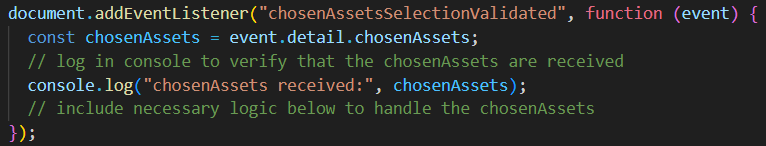
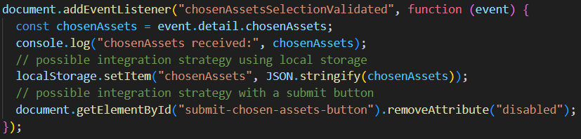

# GIS Asset Chooser Development

## The asset chooser is made of two reusable custom web components

1. GIS Asset Chooser component
2. Map Layer component

The GIS Asset Chooser Component is a parent to the Map Layer component. It contains the base map.

The Map Layer component is a child to the GIS Asset Chooser component.
An instance of the Map Layer component is used for each layer placed on the map. For example to put 3 different graphic layers on the map, you would use 3 seperate instances of the Map Layer component, one for each layer.

## Use the custom event listener below in the parent application to receive 'chosenAssets' from the GIS Asset Chooser

## Once received 'chosenAssets' can be used as needed within the parent application

### Possible integration strategies include

1. using local storage to save 'chosenAssets'
2. using a submit button to send or store 'chosenAssets' and any other necessary related data

